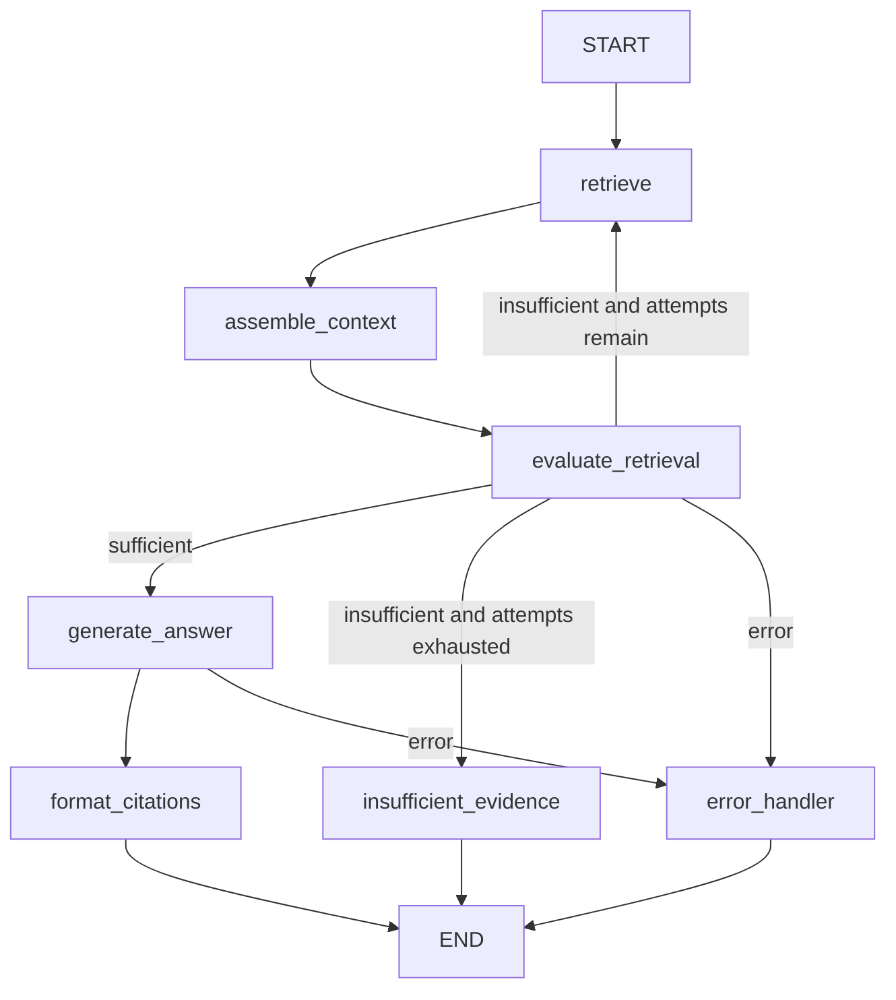

# LangGraph workflow

This application uses LangGraph to make the evidence gate explicit and bounded.

## Nodes

| Node | Responsibility |
| --- | --- |
| `retrieve` | Creates a Qwen query embedding, searches Pinecone, and merges deterministic lexical results. |
| `assemble_context` | Removes duplicate/overlapping chunks, sorts them, and enforces the context budget. |
| `evaluate_retrieval` | Deterministically decides if evidence is sufficient. A strong semantic match passes; a modest semantic result needs strong lexical corroboration. |
| `generate_answer` | Calls Ministral/Mistral only after evidence has passed the gate. |
| `format_citations` | Maps `[n]` markers only to chunks returned for this request; unsupported generated sentences are removed. |
| `insufficient_evidence` | Returns the fixed refusal text without an LLM call. |
| `error_handler` | Terminal error path. |

## Bounded retry

There are at most two retrieval attempts:

| Attempt | Pinecone semantic top-k | Lexical top-k | Threshold |
| --- | ---: | ---: | ---: |
| 1 | 6 | 2 | 0.62 |
| 2 | 10 | 4 | 0.58 |

`attempt_count` is incremented only in `evaluate_retrieval`. The graph recursion limit is derived from the topology: `(max_attempts * 3) + 2`, which is `8` for two attempts. Every graph path ends at `format_citations`, `insufficient_evidence`, or `error_handler`.

## Grounding guarantee

The LLM receives numbered context blocks and may cite only `[1]`, `[2]`, and so on. Server-side formatting maps those numbers to the retrieved chunk list; invalid markers are dropped, never guessed. A citation therefore cannot reference a vector that was not retrieved in that same query.
